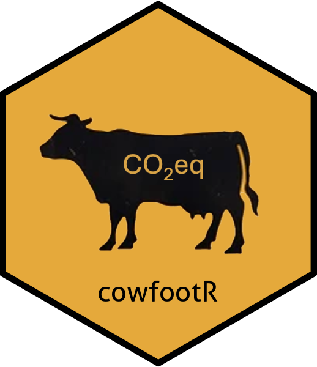

```{r, include = FALSE}
knitr::opts_chunk$set(
  collapse = TRUE,
  comment = "#>",
  fig.path = "man/figures/README-",
  out.width = "100%"
)
```

# cowfootR 

Tools to estimate the carbon footprint of dairy farms.  
Implements methods based on IDF (International Dairy Federation)  
and IPCC guidelines for greenhouse gas accounting.

<!-- badges: start -->
[](https://CRAN.R-project.org/package=cowfootR)
[](https://github.com/juanmarcosmoreno-arch/cowfootR/actions/workflows/R-CMD-check.yaml)
[](https://www.repostatus.org/#active)
[](https://lifecycle.r-lib.org/articles/stages.html#maturing)
<!-- badges: end -->

## Overview

`cowfootR` provides a comprehensive toolkit for calculating carbon footprints of dairy farms following IPCC guidelines. The package includes:

- **Individual emission calculations** from enteric fermentation, manure, soil, energy, and inputs
- **Batch processing** capabilities for multiple farms
- **Intensity metrics** per liter of milk and per hectare
- **System boundary flexibility** (farm gate, cradle-to-farm gate, etc.)
- **Excel integration** for data input and report generation

## Installation

You can install the development version of cowfootR from GitHub:

```{r installation, eval=FALSE}
# Install development version from GitHub
# install.packages("devtools")
devtools::install_github("juanmarcosmoreno-arch/cowfootR")
```

## Quick Start

### Single Farm Analysis

This is a basic example of how to calculate the carbon footprint of a single farm:

```{r example, eval=FALSE}
library(cowfootR)

# 1. Define system boundaries
boundaries <- set_system_boundaries("farm_gate")

# 2. Calculate emissions by source
enteric <- calc_emissions_enteric(
  n_animals = 100, 
  cattle_category = "dairy_cows",
  boundaries = boundaries
)

manure <- calc_emissions_manure(
  n_cows = 100, 
  boundaries = boundaries
)

soil <- calc_emissions_soil(
  n_fertilizer_synthetic = 1500, 
  n_excreta_pasture = 5000, 
  area_ha = 120,
  boundaries = boundaries
)

energy <- calc_emissions_energy(
  diesel_l = 2000, 
  electricity_kwh = 5000, 
  boundaries = boundaries
)

inputs <- calc_emissions_inputs(
  conc_kg = 1000, 
  fert_n_kg = 500, 
  boundaries = boundaries
)

# 3. Calculate total emissions
total_emissions <- calc_total_emissions(enteric, manure, soil, energy, inputs)
print(paste("Total emissions:", round(total_emissions$total_co2eq, 1), "kg CO2eq"))

# 4. Calculate intensity metrics
milk_intensity <- calc_intensity_litre(
  total_emissions = total_emissions,
  milk_litres = 750000,
  fat = 4.0,
  protein = 3.3
)
print(paste("Milk intensity:", round(milk_intensity$intensity_co2eq_per_kg_fpcm, 2), 
            "kg CO2eq/kg FPCM"))

area_intensity <- calc_intensity_area(
  total_emissions = total_emissions,
  area_total_ha = 120
)
print(paste("Area intensity:", round(area_intensity$intensity_per_total_ha, 1), 
            "kg CO2eq/ha"))
```

### Batch Processing Workflow

For analyzing multiple farms, use the Excel template approach:

```{r batch, eval=FALSE}
# 1. Download and fill template
cf_download_template("my_farms_template.xlsx")
# Open the file, fill with your farm data, and save

# 2. Read data and process multiple farms
farm_data <- readxl::read_excel("my_farms_data.xlsx")
results <- calc_batch(
  data = farm_data,
  tier = 2,
  benchmark_region = "uruguay"  # optional
)

# 3. View processing summary
print(results$summary)

# 4. Export comprehensive results to Excel
export_hdc_report(results, "carbon_footprint_results.xlsx")
```

### Working with Data Frames

You can also work directly with data frames:

```{r dataframe, eval=FALSE}
# Example farm data
farm_data <- data.frame(
  FarmID = c("Farm_A", "Farm_B", "Farm_C"),
  Year = c("2023", "2023", "2023"),
  Milk_litres = c(500000, 750000, 300000),
  Fat_percent = c(4.0, 3.8, 4.2),
  Protein_percent = c(3.3, 3.2, 3.4),
  Cows_milking = c(100, 150, 60),
  Area_total_ha = c(200, 300, 120),
  N_fertilizer_kg = c(2000, 3000, 1200),
  Diesel_litres = c(4000, 6000, 2400),
  Electricity_kWh = c(10000, 15000, 6000)
)

# Process all farms
results <- calc_batch(farm_data, tier = 2)

# Check results for each farm
for (i in seq_along(results$farm_results)) {
  farm <- results$farm_results[[i]]
  if (farm$success) {
    cat("Farm", farm$farm_id, ":", round(farm$emissions_total, 1), "kg CO2eq\n")
  } else {
    cat("Farm", farm$farm_id, ": ERROR -", farm$error, "\n")
  }
}
```

## Key Features

### Emission Sources Covered

- **Enteric fermentation**: CH₄ from ruminal fermentation
- **Manure management**: CH₄ and N₂O from manure systems
- **Soil emissions**: N₂O from fertilizer application and excreta
- **Energy consumption**: CO₂ from diesel, electricity, and other fuels
- **External inputs**: CO₂eq from feed, fertilizers, and materials

### System Boundaries

```{r boundaries, eval=FALSE}
# Farm gate (direct on-farm emissions only)
boundaries_fg <- set_system_boundaries("farm_gate")

# Cradle to farm gate (includes upstream production)
boundaries_cfg <- set_system_boundaries("cradle_to_farm_gate")

# Use in calculations
results <- calc_batch(farm_data, boundaries = boundaries_cfg)
```

### Intensity Metrics

The package calculates multiple intensity metrics:

- **Per liter of milk**: kg CO₂eq per liter
- **Per kg FPCM**: kg CO₂eq per kg Fat and Protein Corrected Milk
- **Per hectare**: kg CO₂eq per hectare (total and productive area)
- **Land use efficiency**: productive area / total area ratio

## Data Requirements

### Required Columns
- `FarmID`: Unique farm identifier
- `Year`: Year of data collection  
- `Milk_litres`: Annual milk production (liters)
- `Cows_milking`: Number of milking cows
- `Area_total_ha`: Total farm area (hectares)

### Optional Columns
- Animal data: `Cows_dry`, `Heifers_total`, `Calves_total`, `Bulls_total`
- Production: `Fat_percent`, `Protein_percent`, `Milk_yield_kg_cow_year`
- Feed: `MS_intake_cows_milking_kg_day`, `Ym_percent`, `Concentrate_feed_kg`
- Fertilizer: `N_fertilizer_kg`, `N_fertilizer_organic_kg`
- Energy: `Diesel_litres`, `Electricity_kWh`, `Petrol_litres`
- Land use: `Area_productive_ha`, `Pasture_permanent_ha`

Use `cf_download_template()` to get the complete column structure.

## Error Handling

The package includes robust error handling for batch processing:

```{r error_handling, eval=FALSE}
# Process with error handling
results <- calc_batch(farm_data)

# Check for processing errors
if (results$summary$n_farms_with_errors > 0) {
  error_farms <- results$farm_results[
    sapply(results$farm_results, function(x) !x$success)
  ]
  
  for (farm in error_farms) {
    cat("Farm", farm$farm_id, "failed:", farm$error, "\n")
  }
}
```

## Contributing

This package is under active development. Please report issues or suggest improvements on [GitHub](https://github.com/juanmarcosmoreno-arch/cowfootR/issues).

## References

- IPCC 2019 Refinement to the 2006 IPCC Guidelines for National Greenhouse Gas Inventories
- International Dairy Federation (IDF). 2015. A common carbon footprint approach for the dairy sector
- FAO. 2010. Greenhouse Gas Emissions from the Dairy Sector

## License

MIT License © 2025 Juan Moreno

[](https://juanmarcosmoreno-arch.github.io/cowfootR/)
