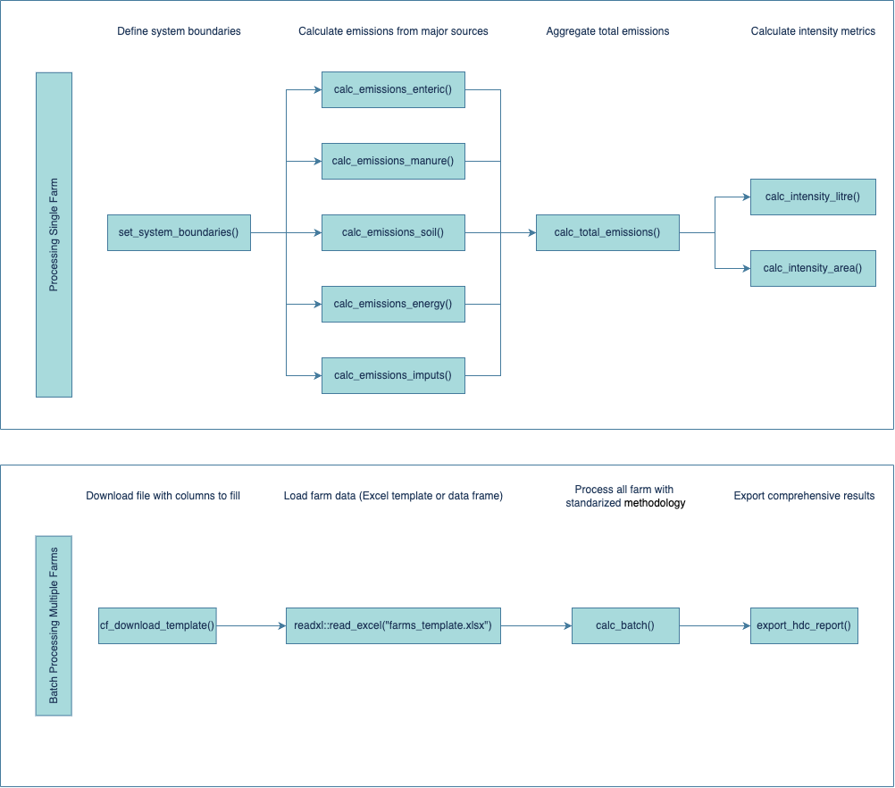

# Summary

The cowfootR package is an open-source R package designed for comprehensive 
carbon footprint assessment of dairy farms, implementing internationally 
recognized methodologies including Intergovernmental Panel on Climate Change 
(IPCC) Guidelines and International Dairy Federation (IDF) standards. The 
package enables transparent and reproducible estimation of carbon emissions 
from dairy production systems through modular functions that estimate emissions 
from five key sources: enteric fermentation, manure management, soil nitrogen 
dynamics, energy consumption, and purchased inputs, supporting both Tier 1 and 
Tier 2 IPCC methodologies. Key features include standardized intensity metrics 
(kg CO₂eq per kg of fat-protein corrected milk, per hectare), batch processing 
capabilities for multiple farms, and regional benchmarking tools. Unless otherwise 
stated, absolute greenhouse gas emissions reported by cowfootR are annual emissions 
expressed as kg CO₂-equivalent per year at the farm (system) level, consistent with 
IPCC and IDF accounting frameworks. By transforming complex carbon accounting into 
accessible workflows, cowfootR empowers researchers, agricultural consultants, and 
policymakers to evaluate mitigation strategies, monitor environmental progress, and 
enhance the sustainability of dairy operations while addressing the critical need for 
standardized, reproducible carbon assessment in agricultural systems.

# Statement of need

The environmental impact of milk production is a subject of growing global 
concern due to the sector's contribution to anthropogenic greenhouse gas (GHG) 
emissions. Global analyses of food systems indicate that livestock production 
is a major contributor to agricultural emissions and environmental impacts 
[@poore2018]. One of the key indicators in environmental impact assessment is 
the carbon footprint (CF), which quantifies the total greenhouse gas emissions 
associated with a product or process and expresses them as carbon dioxide 
equivalents (CO₂e or CO₂eq). In dairy systems, these emissions arise from 
multiple sources including enteric fermentation, manure management, feed 
production, fertilizer use, energy consumption, and other external inputs 
[@stolarski2025].

The dairy sector is estimated to contribute approximately 4% of global
greenhouse gas emissions, with reported carbon footprint values ranging from
approximately 0.78 to 3.20 kg CO₂eq per kilogram of milk depending on
production system characteristics and regional conditions
[@flysjo2011; @stolarski2025]. Accurate quantification of emissions from
livestock systems is therefore essential for evaluating mitigation strategies,
supporting policy development, and enabling consistent environmental reporting
[@ipcc2019].

Several methodological frameworks are currently used to estimate greenhouse
gas emissions from dairy systems. The Intergovernmental Panel on Climate
Change (IPCC) Guidelines for National Greenhouse Gas Inventories define
tiered methodologies (Tier 1, Tier 2 and Tier 3) that differ in complexity
and data requirements for estimating emissions such as enteric methane and
manure management emissions [@ipcc2019]. In parallel, sector-specific
standards such as the International Dairy Federation (IDF) Global Carbon
Footprint Standard for the Dairy Sector provide guidance for applying life
cycle assessment (LCA) principles to dairy supply chains, ensuring
methodological consistency and comparability across production systems
[@idf2022].

Despite the availability of these methodological frameworks, practical tools
for implementing them remain limited. Many existing LCA platforms are
proprietary software requiring specialized training, while advisory services
often rely on spreadsheet-based calculators that can be difficult to audit,
reproduce, or integrate with statistical workflows. Methodological
inconsistencies and lack of transparency in these tools can limit the
comparability of results across farms, regions, and research studies
[@pirlo2012].

The cowfootR package addresses these challenges by providing an open-source,
fully scriptable implementation of dairy carbon footprint methodologies
within the R ecosystem. The package implements emission calculations
following IPCC and IDF frameworks using a modular structure that estimates
emissions from five key sources: enteric fermentation, manure management,
soil nitrogen dynamics, energy consumption, and purchased inputs. In
addition to total emissions, cowfootR provides standardized intensity
metrics (e.g., kg CO₂eq per kg of fat-protein corrected milk or per
hectare), batch processing functions for multi-farm analyses, and flexible
system boundary definitions. By enabling transparent, reproducible and
programmable carbon footprint calculations, cowfootR facilitates the
integration of dairy environmental assessments with modern data-science and
research workflows.

# Usage
With cowfootR, users can estimate emissions for dairy farms using a systematic, 
modular approach based on annual production and management data. Total emissions 
correspond to one accounting year, while intensity metrics are calculated per unit 
of product or per unit of managed area. The package follows a standard workflow: defining system 
boundaries, calculating emissions by source, aggregating total emissions, 
and computing intensity metrics.

# Workflow

# Availability

The cowfootR package is freely available on both [CRAN](https://cran.r-project.org/package=cowfootR) and 
[GitHub](https://github.com/juanmarcosmoreno-arch/cowfootR). Comprehensive documentation, including vignettes and 
reproducible examples, is provided to facilitate adoption and integration into research and sustainability assessment workflows.
cowfootR package is available on GitHub (https://github.com/juanmarcosmoreno-arch/cowfootR). Documentation, including 
vignettes and examples, is provided to facilitate adoption.

# Acknowledgements

The author would like to thank the Sustainability Team at CONAPROLE for their 
valuable input and collaboration in the development and validation of this 
software. Their expertise in dairy farm operations and environmental assessment 
has been instrumental in ensuring the practical applicability and accuracy of 
the cowfootR package.

# References
